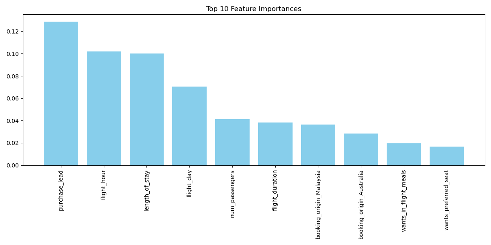

# ✈️ British Airways Data Science Job Simulation – July 2025

This repository showcases my completion of the **British Airways Data Science Job Simulation** hosted on [Forage](https://www.theforage.com/), where I explored the critical role of data science in enhancing customer experience and driving business strategy.

## 🔍 Project Overview

- Completed a job simulation focused on how data science supports British Airways' commercial decisions.
- Scraped and analyzed customer review data to uncover valuable insights.
- Built a predictive model to understand key factors influencing customer purchasing behavior.

## 📊 Feature Importance

Below is a visualization of the top 10 most important features influencing customer purchase behavior as identified by the model:

Completation Certificate ()

## 📁 Files Included

- `Getting Started.ipynb`: Jupyter notebook with the entire workflow (data preprocessing, modeling, visualization).
- `feature_importance.png`: Bar chart showing the top 10 features driving predictions.

## 🧠 Key Insights

- **Purchase lead time**, **flight hour**, and **length of stay** were the most influential factors.
- Behavioral features and booking origin also played a moderate role in model predictions.
- Insights can help British Airways tailor promotions, pricing strategies, and service improvements.

## 🛠️ Tools & Technologies

- Python
- Pandas, NumPy
- Scikit-learn
- Matplotlib

## 📌 About the Program

This project was completed as part of a **virtual internship simulation** provided by **British Airways and Forage**, giving candidates a real-world experience of data science in the aviation industry.

---

✅ Feel free to explore, fork, or contribute!

📫 For project inquiries or collaboration: 
email: praveen11x@gmail.com
website: https://datatrendx.com/
